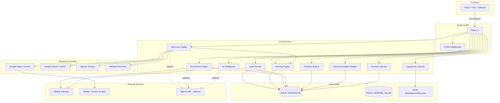
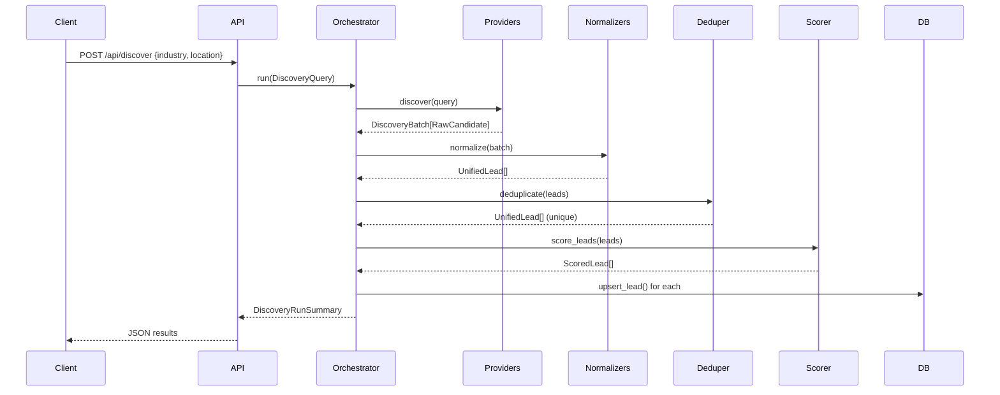
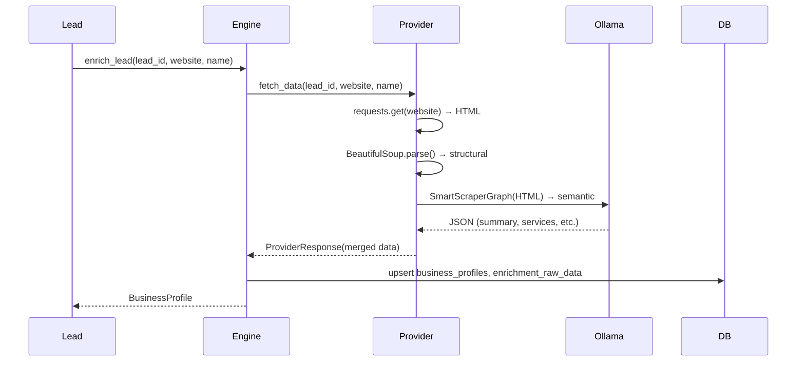
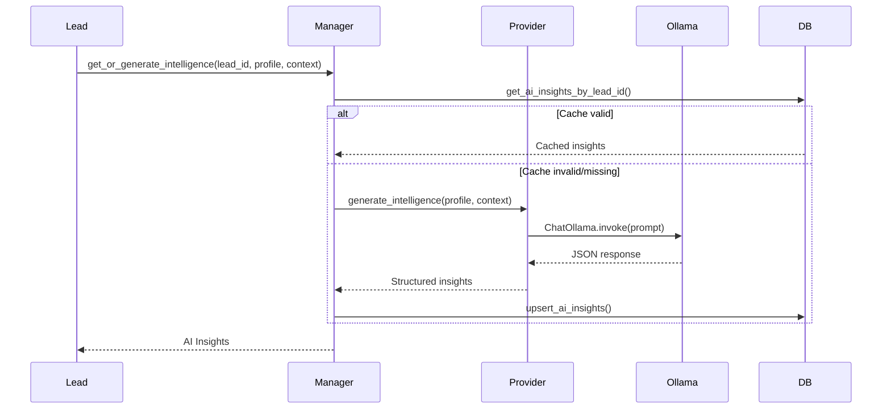
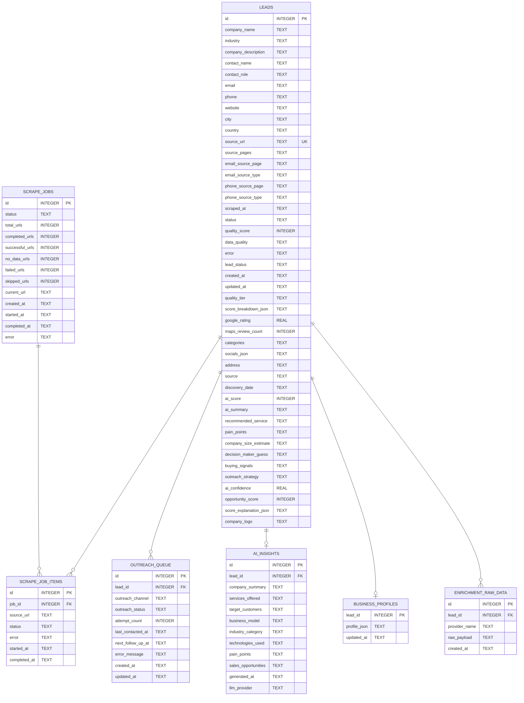
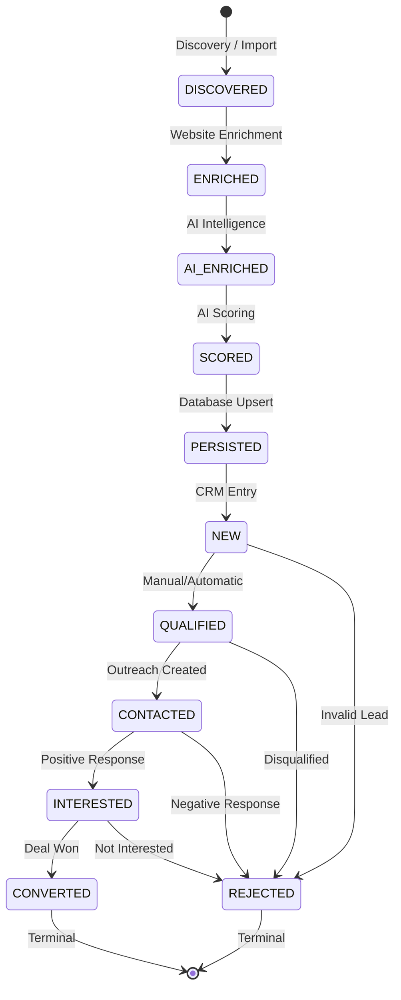
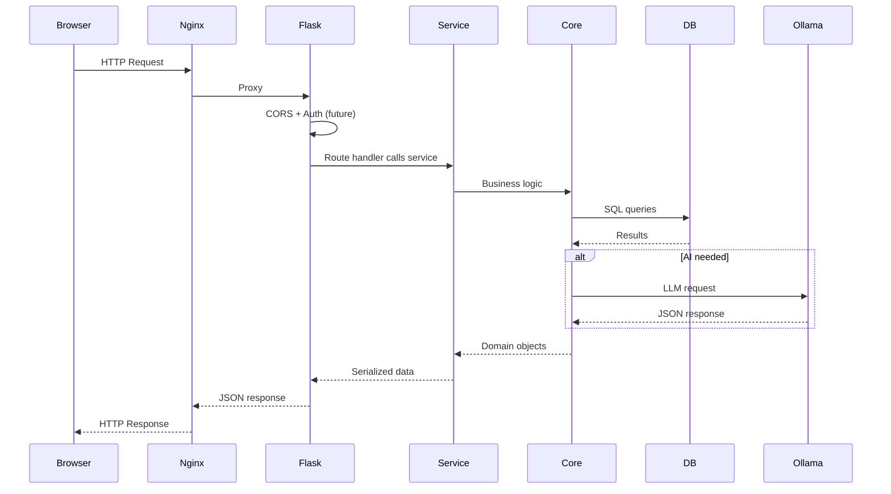
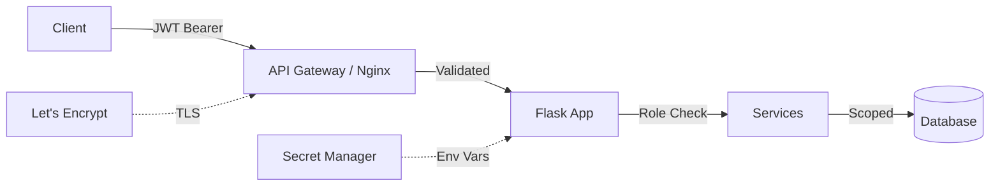
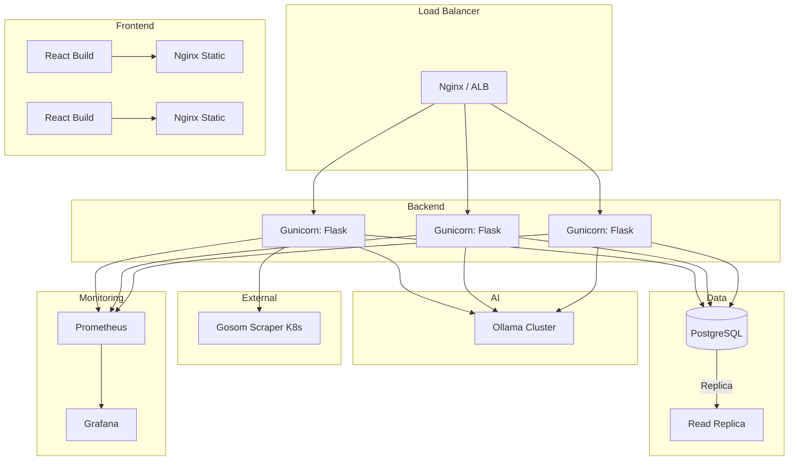

# Architecture Documentation

System architecture overview for AI Lead Scraper CRM.

---

## High-Level Architecture



---

## Component Details

### Frontend Layer

**Technology Stack:**
- React 19.1.0
- Vite 6.3.5 (build tool + dev server)
- TailwindCSS 4.1.7 (styling)
- React Router DOM 7.6.1 (routing)
- Recharts 2.15.3 (visualizations)
- TanStack Table 8.21.3 (data tables)
- Axios 1.8.4 (HTTP client)
- Lucide React 0.487.0 (icons)

**Architecture Pattern:**
- Component-based with hooks for state/logic
- Service layer for API communication
- Page components compose reusable UI components
- Context providers for global state (dark mode, etc.)

**Key Directories:**
```
frontend/src/
├── components/
│   ├── layout/        # Navbar, Sidebar, PageHeader, StatCard
│   ├── leads/         # LeadTable, LeadDetailsDrawer, LeadSummaryCard
│   ├── intelligence/  # AIInsightsPanel, AICompanySummary, etc.
│   ├── repository/    # LeadRepository components
│   ├── reusable/      # FilterPanel, SearchBar, Pagination, Charts
│   └── ...
├── pages/             # Page-level components
│   ├── Dashboard/
│   ├── Leads/
│   ├── Discover/
│   ├── Analytics/
│   └── Opportunities/
├── services/          # API clients
├── hooks/             # Custom React hooks
├── utils/             # Helpers
└── App.jsx            # Routes + providers
```

### Backend API Layer

**Technology Stack:**
- Flask 3.1.3
- Flask-CORS 6.0.5
- python-dotenv for configuration

**Application Factory Pattern:**
```python
def create_app(config: Dict | None = None) -> Flask:
    app = Flask("bilvaleaf_bdp")
    CORS(app)
    # ... route registration
    return app
```

**Route Organization:**
- All routes defined in `api/app.py` (single file, ~1400 lines)
- Modular route registration via `register_*_routes(app)` functions
- Blueprint-style separation in `api/routes/`

**Request Flow:**
```
HTTP Request
    → Flask Router
    → Route Handler (in app.py)
    → Service Layer (api/services/)
    → Core Services (scraper/)
    → Database (scraper/database.py)
    → JSON Response
```

### Core Services Layer

#### Lead Service (`api/services/lead_service.py`)
- CRUD operations for leads
- Advanced search with filters
- Bulk operations
- Statistics aggregation

#### Discovery Engine (`scraper/discovery/`)
```
DiscoveryOrchestrator
    ├── ProviderRegistry (google_maps, google_search, upwork, website)
    ├── DiscoveryQuery → DiscoveryBatch
    ├── Normalizers (provider-specific → UnifiedLead)
    ├── LeadDeduper (cross-source deduplication)
    └── ScoringEngine (FeatureExtractor + ScoreCalculator)
```

**Discovery Flow:**


#### Enrichment Engine (`api/services/enrichment/`)
```
UnifiedEnrichmentEngine
    ├── WebsiteEnrichmentProvider (BeautifulSoup + ScrapeGraphAI)
    ├── Provider Interface (BaseEnrichmentProvider)
    └── Parallel fetch → Merge → Persist
```

**Enrichment Flow:**


#### AI Intelligence (`api/services/ai_intelligence.py`)
```
IntelligenceManager
    ├── OllamaProvider (ChatOllama via LangChain)
    ├── OpenAIProvider (optional)
    └── Cache validation (ai_insights table)
```

**Intelligence Flow:**


#### Scoring Engine (`scraper/scoring/`)
```
ScoringEngine
    ├── FeatureExtractor (14 feature methods → 0.0-1.0 ratios)
    ├── WeightProvider (YAML config: config/lead_scoring.yaml)
    └── ScoreCalculator (Σ weight × ratio)
```

**Scoring Features (14):**
| Feature | Weight | Extractor Method |
|---------|--------|-----------------|
| website_exists | 15 | `website_exists()` |
| business_email | 12 | `business_email()` |
| phone_number | 8 | `phone_number()` |
| description_quality | 6 | `description_quality()` |
| location_quality | 5 | `location_quality()` |
| multiple_sources | 6 | `multiple_sources()` |
| social_profiles | 3 | `social_profiles()` |
| company_size_hints | 4 | `company_size_hints()` |
| recent_activity | 3 | `recent_activity()` |
| provider_confidence | 2 | `provider_confidence()` |
| ai_enrichment_confidence | 4 | `ai_enrichment_confidence()` |
| google_rating | 8 | Extended (AI enrichment) |
| review_count | 6 | Extended (AI enrichment) |
| company_size | 8 | Extended (AI enrichment) |
| ai_enrichment_quality | 10 | Extended (AI enrichment) |

**Quality Tiers:**
- **Excellent**: ≥ 70
- **Good**: ≥ 50
- **Average**: ≥ 30 (floor)

#### Analytics Engine (`scraper/analytics/`)
```
AnalyticsService
    ├── Statistics (counts, averages, distributions)
    ├── TrendAnalysis (time-series: daily/weekly/monthly)
    └── Insights (AI-generated: top opportunities, pain points, services)
```

#### Recommendation Engine (`scraper/recommendations/`)
```
RecommendationEngine
    ├── PriorityRules (HIGH/MEDIUM/LOW)
    └── NextActionGenerator (channel, talking points)
```

---

## Data Layer

### SQLite Database Schema

**Main Database:** `data/leads.db`



### Repository Database: `data/leads_repo.db`
- Separate SQLite for LeadRepository pattern (Phase 19)
- Used by `scraper/persistence/repository.py`
- Configured via `LEAD_REPOSITORY_URI` env var

### Opportunities Store: `data/opportunities.json`
- File-based JSON store (not SQLite)
- Used by `scraper/opportunities/opportunity_repository.py`
- Upwork, Freelancer, Guru, PeoplePerHour providers

---

## External Services Integration

### Ollama (Required)
```
┌─────────────┐     HTTP/1.1      ┌─────────────┐
│  Backend    │ ─────────────────▶ │   Ollama    │
│  (Enrichment│   POST /api/      │  (llama3.2) │
│   Intelligence)   generate      │  localhost  │
└─────────────┘     ◀───────────── │  :11434     │
       ▲                          └─────────────┘
       │  JSON Response
       │
   LangChain
   ChatOllama
```

**Configuration:**
- `OLLAMA_BASE_URL=http://localhost:11434`
- `SCRAPEGRAPH_MODEL=ollama/llama3.2`
- `AI_INTELLIGENCE_PROVIDER=ollama`

**Used By:**
- `WebsiteEnrichmentProvider` (ScrapeGraphAI)
- `OllamaProvider` (AI Intelligence)
- `SmartScraperGraph` (semantic extraction)

### Gosom Google Maps Scraper (Docker)
```
┌─────────────┐     HTTP/REST     ┌──────────────────┐
│  GoogleMaps │ ─────────────────▶ │  Docker: Gosom   │
│  Discovery  │   POST /jobs      │  google-maps-    │
│  Provider   │   GET /jobs/{id}  │  scraper         │
│  (Python)   │   GET /download   │  (Go + Playwright)│
└─────────────┘     ◀───────────── └──────────────────┘
       ▲                          Port 8080
       │  CSV Download
       │
   Polling
   5s interval
   10min max
```

**Configuration:**
- `API_BASE_URL = "http://localhost:8080/api/v1"` (hardcoded in provider)

**Flow:**
1. Submit job with keywords → returns job_id
2. Poll `/jobs/{id}` until status = "completed"
3. Download CSV from `/jobs/{id}/download`
4. Parse CSV → RawCandidate → Normalizer → UnifiedLead

### OpenAI (Optional)
```
┌─────────────┐     HTTPS/REST    ┌─────────────┐
│  Backend    │ ─────────────────▶ │  OpenAI     │
│  (Optional) │   Chat Completion │  API        │
└─────────────┘     ◀───────────── └─────────────┘
       ▲
       │
   AI_INTELLIGENCE_PROVIDER=openai
   OPENAI_API_KEY=sk-...
```

**Used When:** `AI_INTELLIGENCE_PROVIDER=openai` in `.env`

---

## Data Flow Diagrams

### Lead Lifecycle



### API Request Flow



---

## Configuration Management

### Environment Variables (`.env`)
```
OLLAMA_BASE_URL=http://localhost:11434
SCRAPEGRAPH_MODEL=ollama/llama3.2
AI_INTELLIGENCE_PROVIDER=ollama
DATABASE=data/leads.db
VITE_API_URL=http://localhost:5000
OUTREACH_WEBHOOK_URL=
OUTREACH_BATCH_LIMIT=10
OUTREACH_MAX_RETRY=3
LEAD_REPOSITORY_URI=sqlite:///data/leads_repo.db
```

### Scoring Configuration (`config/lead_scoring.yaml`)
```yaml
features:
  website_exists:
    weight: 15
    description: "Lead has a website URL"
    enabled: true
  # ... 13 more features

thresholds:
  excellent: 70
  good: 50
  average: 30

opportunity_thresholds:
  high: 64
  medium: 50
  low: 35
```

### Persistence Config (`scraper/persistence/config.py`)
```python
@dataclass
class PersistenceConfig:
    backend_uri: str = os.getenv("LEAD_REPOSITORY_URI", default_sqlite_uri())
    page_size_default: int = 50
    page_size_max: int = 500
```

---

## Security Architecture

### Current (Development)
- No authentication
- No authorization
- CORS enabled for all origins
- HTTP only (no TLS)
- Secrets in `.env` (gitignored)

### Planned (Production)


- JWT authentication middleware
- Role-based access (admin, user, readonly)
- Rate limiting (Flask-Limiter)
- HTTPS via Nginx + Certbot
- Secrets via Docker secrets / HashiCorp Vault

---

## Deployment Architecture (Future)



---

## Technology Decisions Log

| Decision | Rationale | Alternative Considered |
|----------|-----------|------------------------|
| **SQLite** | Zero-config, file-based, sufficient for dev/single-user | PostgreSQL (planned for prod) |
| **Flask** | Lightweight, flexible, no ORM lock-in | FastAPI, Django |
| **React + Vite** | Modern, fast HMR, small bundle | Next.js, Vue |
| **Ollama + llama3.2** | Local, free, privacy, good JSON | OpenAI, Anthropic, local Llama.cpp |
| **Gosom (Docker)** | Best Google Maps scraper, maintained | Selenium, Playwright direct, Apify |
| **DDGS (DuckDuckGo)** | Free search backend, no API key | SerpAPI, Google Custom Search |
| **ScrapeGraphAI** | LLM-guided extraction, handles dynamic sites | BeautifulSoup only, Selenium |
| **YAML Scoring Config** | Non-dev adjustable weights, versionable | Hardcoded, DB-stored |
| **File-based Opportunities** | Simple, portable, no migration needed | SQLite table |

---

## Extension Points

### Adding a Discovery Provider
1. Create `scraper/discovery/providers/<name>_provider.py`
2. Extend `DiscoveryProvider` base class
3. Implement `discover(query: DiscoveryQuery) -> DiscoveryBatch`
4. Register in `scraper/discovery/registry.py`
5. Add normalizer if needed in `scraper/discovery/normalizers/`

### Adding an Enrichment Provider
1. Create provider in `api/services/enrichment/`
2. Extend `BaseEnrichmentProvider`
3. Implement `fetch_data(lead_id, website, company_name)`
4. Register in `UnifiedEnrichmentEngine`

### Adding an Import Adapter
1. Create `scraper/import_package/<source>.py`
2. Extend `BaseImportAdapter`
3. Implement `parse_file()` and `map_record()`
3. Auto-registers via `registry.register()` on import

### Modifying Scoring
- Edit `config/lead_scoring.yaml` — no code changes needed
- Add new feature: implement in `FeatureExtractor`, add to YAML
- Restart backend to reload config

---

*Architecture documentation generated from source code analysis. Update when significant changes made.*