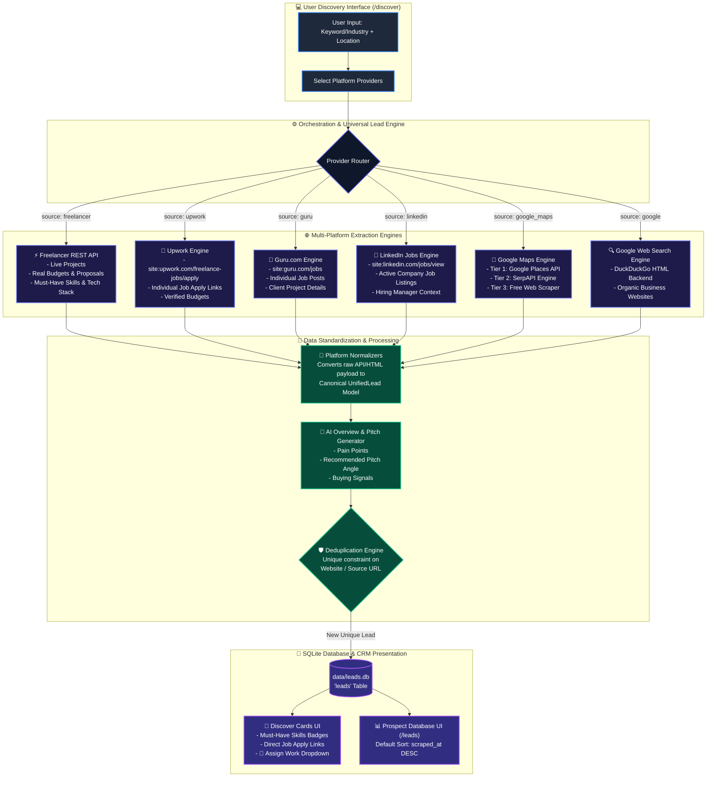
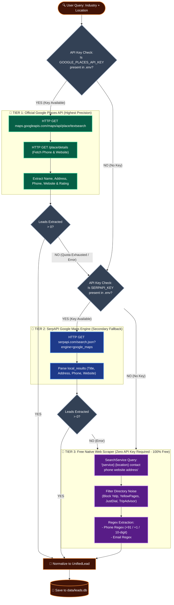

# 🗺️ System Architecture & 3-Tiered Extraction Diagrams

This document contains the official **Mermaid Architecture Diagrams** for the AI Lead Scraper CRM platform.

---

## 1. 🌐 Multi-Platform Lead Discovery Flowchart

---

## 2. 📍 3-Tiered Hybrid Extraction Pipeline

